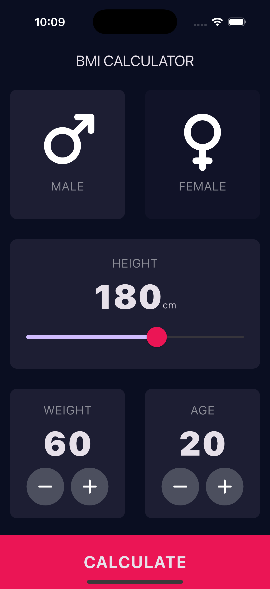
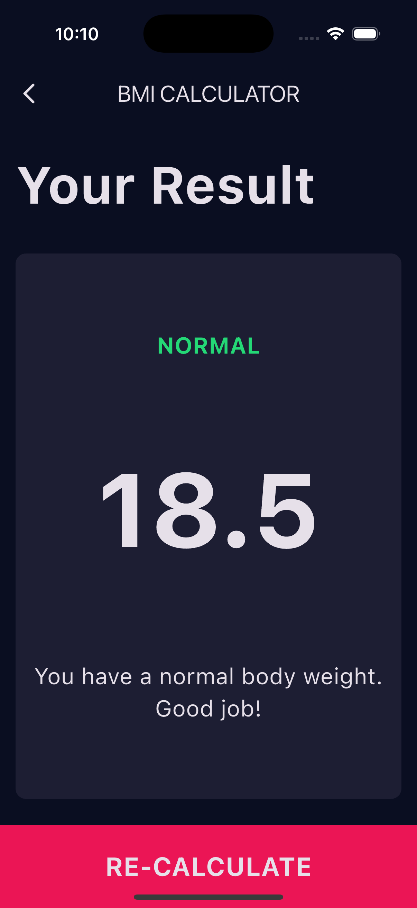

# ⚖️ BMI Calculator (Flutter)

A sophisticated health monitoring application that calculates Body Mass Index based on user input. This project is a major step forward, introducing **Multi-Screen Architecture** and **Custom Theming**.

  
  

## 🎯 Learning Outcomes
By building this project, you will learn:
- **Navigation:** Using `Navigator.push` to switch screens and pass data forward.
- **Theming:** implementing a custom `ThemeData.dark()` to give the app a consistent, professional look.
- **Refactoring UI:** creating custom widgets (`ReusableCard`, `RoundIconButton`) to reduce code duplication.
- **Separation of Concerns:** Moving complex math logic out of the UI file and into a separate `CalculatorBrain` class.

## 📱 Features
- **Gender Selection:** Custom card selectors with active/inactive color states.
- **Height Slider:** A fluid slider widget to capture precise height data.
- **Results Page:** A separate screen that interprets the BMI score (e.g., "Normal", "Overweight") and provides health advice.
- **Dark Mode UI:** A sleek, modern user interface.

## 🚀 How to Run

1. **Ensure you are in the project directory:**
    
    `cd bmi_calculator`
    
2. **Install Dependencies:**
    
    `flutter pub get`
    
3. **Run the App:**
    
    `flutter run`

## 🔙 Back to Main Repo

Find more projects and the full learning roadmap here:
[Flutter Example Apps](https://github.com/thaisangdang/flutter_example_apps)

## 📘 Want to Build Bigger Apps?

This project is just the beginning. If you want to learn how to architect production-ready applications with scalable code, check out my premium guide:

👉 [**Master Flutter Architecture - Build a Production-Ready Social App from Scratch**](https://thaisang.gumroad.com/l/flutter-architecture-build-a-social-app)

## ☕ Support My Work

If you found this project helpful, consider [buying me a coffee](https://buymeacoffee.com/thaisangdang) to keep my work coming!